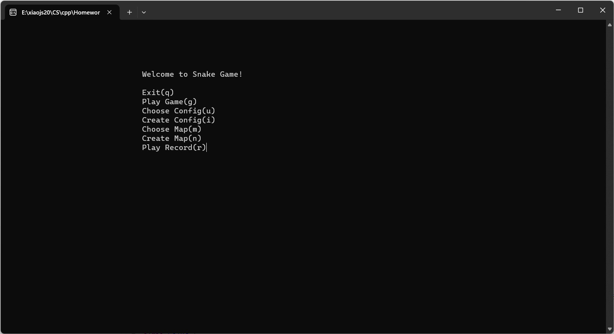
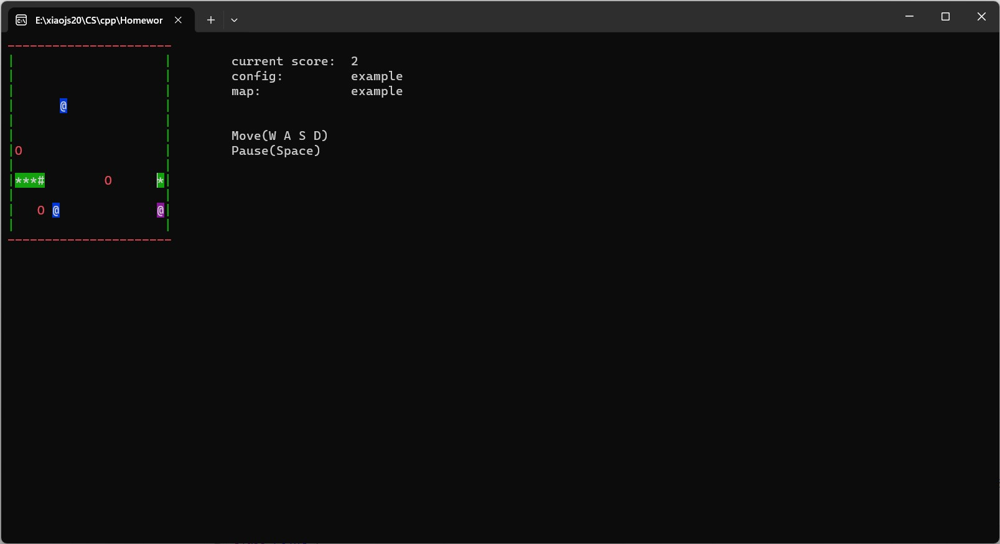
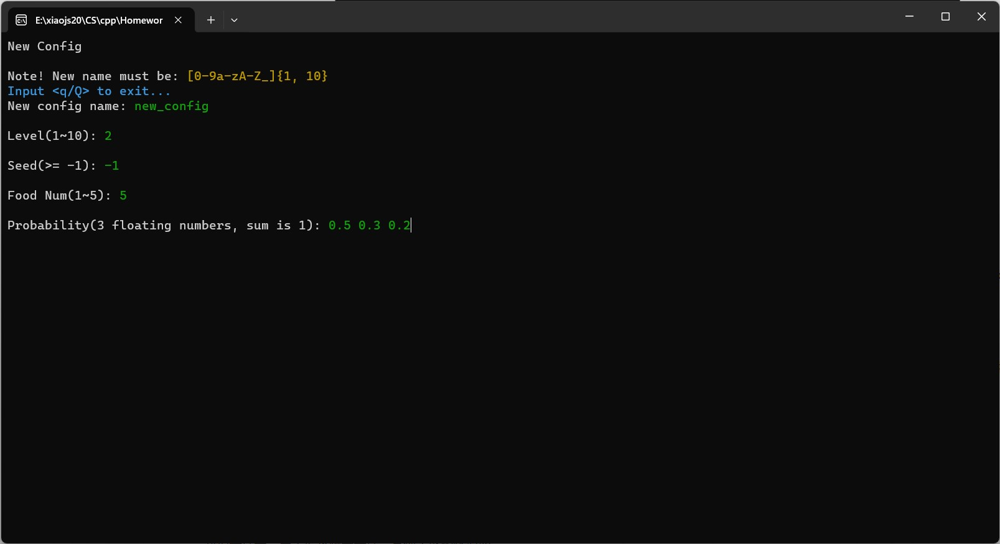
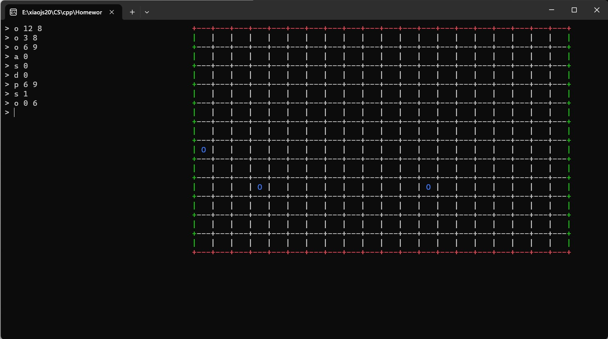

# Greedy Snake

清华大学2023程序设计基础课程大作业

## 小组人员信息

郭恩惠 2020010548 软件12

肖锦松 2020010563 电02

## 源码格式
UTF-8

## 项目运行环境
- Windows 11 22H2
- MinGW-W64-builds-4.3.5
- C++11

## 编译运行
```bash
$ cd src
$ make
```
打开main.exe, 注意不要通过命令行方式`./main.exe`打开

## 功能实现逻辑

### 代码框架

```
Greedy Snake:.
│   .gitignore
│   README.md
|
│
├───doc
│       作业需求文档.pdf
│
└───src
    │   controller.cpp
    │   controller.h
    │   event.cpp
    │   event.h
    │   food.cpp
    │   food.h
    │   main.cpp
    │   main.exe
    │   makefile
    │   map.cpp
    │   map.h
    │   point.cpp
    │   point.h
    │   setting.txt
    │   snake.cpp
    │   snake.h
    │   utils.cpp
    │   utils.h
    │
    ├───config
    │       default.config
    │       medium.config
    │
    ├───maps
    │       default.map
    │       example.map
    │
    └───record
            record_1.rec
```


### 基础游戏环境

#### 主界面

主界面所有跳转逻辑如下

- g：开始游戏，进入游戏界面。
- q：退出游戏
- i：新建自定义配置。可用：输入新配置文件名称，如果是q 退出配置返回主界面，输入配置内容
- u：进行配置载入。可用：输入新配置文件名称，q 退出配置载入过程
- n：进行地图新建。可用：输入新地图文件名称，如果是q 退出配置返回主界面，输入配置内容
- m：进行地图载入。可用：输入新地图文件名称，q 退出地图载入过程
- r：进行记录重放。可用：输入记录文件名称，重放过程 q 退出重放回到主界面
- 非法输入：不处理



相关函数：

- `Controller::MainInterface()`用于维护主界面，主要功能为给出游戏提示以及处理用户输入，包括非法输入，输入不合法时，继续等待用户输入。得到用户输入后返回选项给`Controller::Run()`进行下一步操作
- `Controller::Run()`函数是游戏的主运行循环。在一个无限循环中，用户通过主界面选择不同的功能，然后进入相应的界面。用户可以选择退出游戏、开始游戏、选择配置、创建配置、选择地图、创建地图或播放记录。


#### 游戏界面绘制

游戏界面

- WASD：移动蛇

- space：进入暂停界面。可用：q 退出游戏返回主界面，space 继续游戏
- 游戏结束后
  - b：保存本局游戏记录。可用：输入记录文件名称
  - 其他输入：回到主界面

游戏界面绘制依赖于`class Point`，其维护了点坐标和类型，类型包括：空白、虚实墙体、障碍物、蛇头、蛇身、食物等等，后续维护每个类型为`vector<Point>`，蛇为`deque<Point>`，无论是添加还是打印都非常方便

```C++
class Point {
private:
    int x, y;
    PointType type;
public:
    ...
}
```

- 游戏地图：用`class Map`实现，`Loadmap`用于读取当前地图配置，类中维护了包括地图大小、四面墙的虚实、障碍物的数量和坐标等信息。其中`walls`和`blocks`均为`vector<Point>`，容易添加和打印

- 蛇：用`class Snake`实现，蛇的身体部分利用双端队列`deque<Point>`维护。蛇**增长**时，只需要在列表前端增加身体并且将`head`重新定位到列表第一个元素就行；蛇**移动**时，则是先增长，然后再蛇尾丢弃，类型改成空白地图

- 生成食物：用`class FoodManager`实现，读取自定义配置文件后可以获得生成的食物数量和三种概率，用随机数的方法可以很快生成，打印食物还需要判断其与食物、蛇身、墙体是否重合，`int FoodManager::BeEaten(const Point &head)`判断蛇头是否吃到食物，并且返回应该增加的得分。同样地，食物用`vector<Point>`维护。

- 显示分数配置：`Controller::DrawSidebar()`用于在游戏界面右侧展示出当前的分数、游戏配置名称和地图名称，更新分数或是配置显示可以采用输出覆盖（具体是利用`utils/SetCursor`将光标移动到相同位置后输出）



相关函数：

- `Controller::DrawSidebar()`：绘制游戏界面右侧的侧边栏，显示当前得分、配置和地图信息。默认情况下，显示类中维护的配置和地图信息。可以通过传入参数来显示其他配置和地图信息。
- `Controller::UpdateScore(int score)`：更新游戏得分，显示在侧边栏上。
- `Controller::GamePlayInterface()`：游戏界面函数，负责控制蛇的移动。在一个循环中，用户通过键盘输入控制蛇的移动方向，同时记录用户操作。游戏进行中，判断蛇是否与地图边界或自身相撞，若是则游戏结束。吃到食物时，更新得分并使蛇成长。用户可通过空格键暂停游戏。
- `Controller::GamePause()`：游戏暂停界面函数，提供继续游戏和退出游戏的选项。用户通过空格键继续游戏或按 'q' 键退出游戏。


#### 其他周边功能

`class Controller`中的`ReadSetting()`和`WriteSetting()`用于读写配置文件，`setting`用于储存总配置文件名，其中包含`configname`和`mapname`.

##### 自定义配置功能

自定义配置对应`struct Config`

`class Controller`中维护了成员`UConfig uconfig`用于存储自定义配置，`ReadConfig`用于读取自定义配置，存储配置包括：难度等级、随机种子、食物数量、食物生成概率



相关函数：

- `Controller::ConfigChooseInterface()`

  该函数用于在二级界面中选择配置。用户可以查看当前配置，输入新的配置名称以切换配置。用户还可以随时退出操作。

  - 显示当前配置和提供输入新配置名称的选项。
  - 用户输入 `q` 或 `Q` 可以退出配置选择。
  - 用户输入新配置名称后，判断配置文件是否存在，若不存在则加载新配置，否则提示重新输入。

- `Controller::ConfigCreateInterface()`

  该函数用于在二级界面中创建新的游戏配置。用户可以设置新配置的各种参数，包括难度级别、随机种子、食物数量以及食物生成概率。

  - 提供用户输入新配置名称的选项，同时进行输入格式和文件名的合法性检查。
  - 用户可以设置游戏的难度级别、随机种子、食物数量以及食物生成概率。
  - 难度级别、随机种子和食物数量的输入均进行了范围限制和格式检查。
  - 写入新的配置文件，保存用户输入的配置信息。


##### 地图配置功能



相关函数：

- `Controller::MapChooseInterface()`

  该函数用于在二级界面中选择地图。用户可以查看当前地图，输入新的地图名称以切换地图。用户还可以随时退出操作。

  - 显示当前地图和提供输入新地图名称的选项。
  - 用户输入 `q` 或 `Q` 可以退出地图选择。
  - 用户输入新地图名称后，判断地图文件是否存在，若不存在则加载新地图，否则提示重新输入。

- `Controller::MapCreateInterface()`

  该函数用于在二级界面中创建新的地图。用户可以设置新地图的大小和障碍物位置。

  - 提供用户输入新地图名称的选项，同时进行输入格式和文件名的合法性检查。
  - 用户可以设置地图的宽度和高度，进行了范围限制。
  - 通过绘制地图表格的方式，用户可以选择添加或删除障碍物，并设置墙体的虚实状态。
  - 用户可以输入不同的命令来编辑地图，包括添加障碍物、删除障碍物、设置墙体虚实状态等。
  - 写入新的地图文件，保存用户输入的地图信息。

  以上功能旨在为玩家提供更丰富的游戏体验和更多的自定义选项。游戏控制器通过这些界面函数实现用户与游戏进行交互，使游戏更加灵活和可定制。


##### 游戏记录回放功能

新增事件类，用于记录两类事件，食物生成和蛇活动

```C++
class Event{
private:
    int time;
    int x, y; // 食物坐标、蛇头坐标
    int value; // 食物经验
    EventType type;
public:
    ...
}
```

游戏过程用`vector<Event>`记录所有事件，等待用户选择是否记录。回放时读取记录文件，进行强制操作即可。

回放记录的时候有一个坑，新开一把游戏一定要记得清空之前的记录...

相关函数：

- `Controller::RecordCreateInterface()`

  回放记录创建界面，用户可以创建新的回放记录。用户需要输入回放记录名称，程序会检查名称是否符合规定并且是否已存在同名记录。创建完成后，用户可以选择退出或继续进行游戏。

  - 用户输入回放记录名称，需满足正则表达式 `[a-zA-Z0-9_]{1,10}`。
  - 用户可以随时退出界面，输入 'q' 或 'Q'。
  - 若回放记录文件创建失败，程序会提示错误信息并退出。
  - 回放记录文件将包含配置名称、地图名称以及游戏操作记录（时间、类型、坐标、值）。

- `Controller::RecordPlayInterface()`

  回放记录播放界面，用户可以选择并加载已有的回放记录。程序会检查记录是否存在，若存在则加载并进行回放。回放过程中，用户可以观看蛇的移动、食物的生成与消失，以及得分的变化。

  - 用户输入回放记录名称，若输入 'q' 或 'Q' 则退出播放。
  - 回放记录文件将包含配置名称、地图名称以及游戏操作记录（时间、类型、坐标、值）。
  - 回放时会根据记录的时间信息模拟蛇的移动、食物的生成与消失，并实时更新侧边栏显示的得分信息。
  - 回放结束后，用户可以选择退出或继续进行游戏。


## 小组分工情况

郭恩惠：基本的代码框架，2.1-3.2代码实现

肖锦松：修改已实现的部分代码，主要是增加接口，重载部分函数，3.3代码实现，报告，视频
